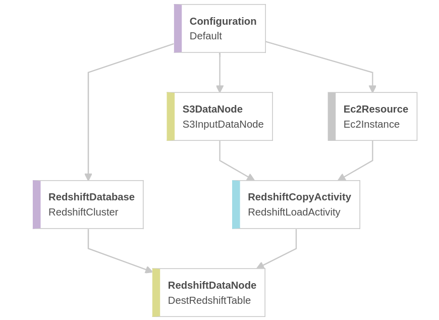
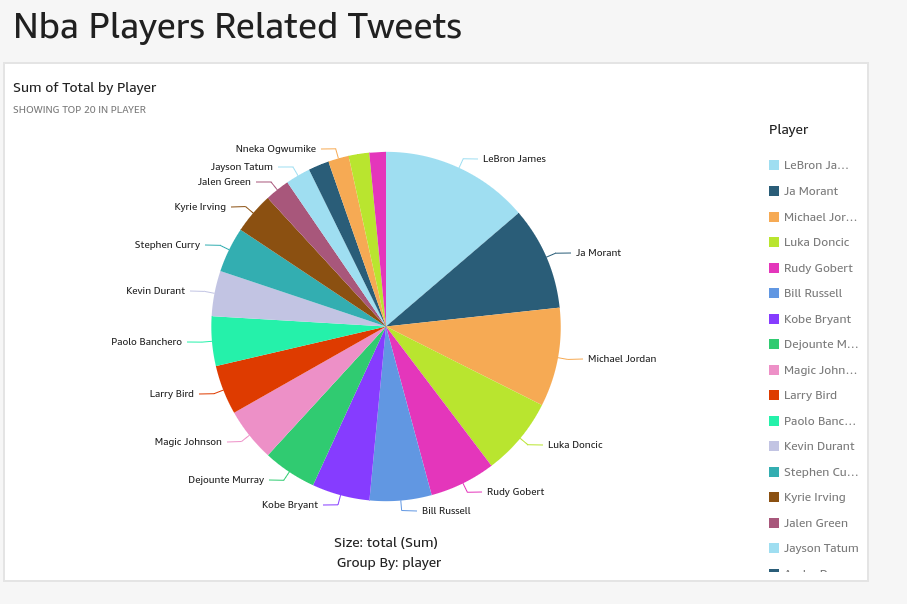

# AWS Twitter Data Analytics

Project to Learn Data Analytics in AWS using twitter data.

## Important Notes

* This project/code isn't optimized for Production.
* Some Architecting decisions doesn't make sense in production only in learning context.
* The configurations aren't cost optimized due learning reasons.
* This architecture doesn't follow the security best practices.
* Most of the AWS services used in this project don't have free tier. Deploy this, will have costs.

## About The Project


The main goal for this project is learning/test/play Data Analytics in AWS using data from twitter.

### Built With

**Data Source**

* [Twitter](https://twitter.com/)

**Deployment**

* [Terraform](https://www.terraform.io/)

**Programming**

* [GO](https://go.dev/)
* [Python](https://www.python.org/)
* [PySpark](https://spark.apache.org/docs/latest/api/python/)
* [Flink](https://flink.apache.org/)
* [Java](https://www.java.com/)
* [Hive](https://hive.apache.org/)
* [GNUMakeFile](https://www.gnu.org/software/make/manual/make.html)

**AWS Services**

* [S3](https://aws.amazon.com/s3/)
* [Lambda](https://aws.amazon.com/lambda/)
* [Kinesis Firehose](https://aws.amazon.com/kinesis/data-firehose/)
* [Kinesis Data Analytics](https://aws.amazon.com/kinesis/data-analytics/)
* [Kinesis Data Streams](https://aws.amazon.com/kinesis/data-streams/)
* [SNS](https://aws.amazon.com/sns/)
* [GLUE - Catalog, Crawler, Job, Workflow](https://aws.amazon.com/glue/)
* [Elastic Map Reduce](https://aws.amazon.com/emr/)
* [Step Functions](https://aws.amazon.com/step-functions/)
* [Redshift](https://aws.amazon.com/redshift/)
* [Data Pipeline](https://aws.amazon.com/datapipeline/)
* [DynamoDB](https://aws.amazon.com/dynamodb/)

### Components:

**Data Collection**

Data collection consist in application written in go app listen twitter stream for tweets.
The go app configure the twitter stream to receive only tweets related with nba.
The app sends the tweets to Kinesis Firehose. 
Kinesis Firehose will store the tweets in S3 after runs a lambda to transform the twitter record. 
Firehose also store in S3 the original records.

**Glue ETL**

The GLUE ETL consists in two steps. One Glue Job that runs a python spark script to remove duplicated tweets and a glue crawler to read the tweets records in s3 and create the table in glue data catalog.
This project has a glue workflow to run these two steps. First remove duplicates and then runs the crawler.

**EMR Cluster**

An EMR Cluster is created to do some tests. The EMR Cluster is created with Hive and configured to Hive use the data catalog.

**Step Functions**


The state machine creates EMR Cluster to run hive scripts. The hive script result is stored in S3 via an external table.

**Redshift**

This component creates a redshift cluster and AWS Data Pipeline.
The Data pipeline loads the data resulting from hive queries stored in S3 to a redshift table.

* Data Pipeline diagram



**Quicksight**

AWS Data Visualisation tool 



**Kinesis Data Analytics**


The Kinesis Data Analytics application develop in Flink, detects if a players from one team did two or more tweets to a player in other team within a specific time window (Tumbling Window).
The result is sent to a kinesis Data stream consumed by a lambda. The lambda sent a notifications via SNS.
This application uses another stream to control if team is allowed to do tampering. The source of this stream is dynamodb kinesis stream.
This application also uses Dynamodb Table to reference data.
The Late data is sent to an S3 Bucket, and all tweets also are sent to another S3 data to archive.


Flink Features in This App:

* Two Connected Streams
* Keyed Streams
* Stateful Stream Processing
* Timely Stream Processing With Watermarks and Event Time
* Windowing Processing
* Side Outputs To Late Events and All Tweets

## Getting Started

### Deploy

***Pre Requisites***

* AWS Cli Configured
* Terraform
* EC2 Key Pair Created to deploy EMR Cluster
* VPC Created at least with one Subnet
* Twitter Keys

```bash
make deploy
```

### Data Collection

**Pre Requisites**

* Golang Installed
* Copy .env.example to .env and add your variables values
  * When the app runs locally, you need have AWS PROFILE configure in your aws credentials file with permissions to assume a role with the necessary permissions to send records to Kinesis firehose
  
You can disable the data collection components changing terraform variable `enable_data_collection` to false.

Execute the following command to run go app:

```shell
make run-collection
```

### Glue ETL

**Pre Requisites:** 

* AWS Cli Configured

You can disable the data glue components changing terraform variable `enable_glue_etl` to false.

Execute the following command to Run Glue Job to Drop duplicates

```shell
make run-drop-duplicates
```

Execute the following command Run Crawler

```shell
make run-crawler
```

Execute the following command to Run Glue Workflow

```shell
make run-glue-workflow
```

### EMR Cluster

You can disable the emr cluster creation by changing terraform variable `enable_emr_cluster` to false.

To do ssh to emr cluster run the following command:

```shell
make EMR_KEY=<key_location> ssh-emr
```

### Step Functions

You can disable step function creation by changing terraform variable `enable_step_functions` to false.

To run the state machine run the following command:

```shell
make STATE_MACHINE_RUN_YEAR=2022 STATE_MACHINE_RUN_MONTH=08 STATE_MACHINE_RUN_DAY=09 run-step-function 
```

### Redshift

You can disable redshift and aws data pipeline creation by changing terraform variable `enable_redshift` to false.

To run the data pipeline run the following command:

```shell
make run-data-pipeline
```

* Run Process Manual (Without AWs Data pipeline)
  * To get `s3_input_dir`, run : `terraform output -json | jq -r .redshift_pipeline_input_s3.value`
  * To get `redshift_role`, run: `terraform output -json | jq -r .redshift_s3_role_arn.value`

```sql
create table playerstotaltweets(
year integer not null,
month integer not null,
day integer not null,
player varchar(255) not null,
total integer not null);

COPY twitter.public.playerstotaltweets
  FROM '<s3_input_dir>'
  IAM_ROLE '<redshift_role>'
  FORMAT AS JSON 'auto'
  REGION AS '<region>';
```

### Quicksight

You can disable quicksight creation by changing terraform variable `enable_quicksight` to false.

**Pre Requisites:**

* Quicksight Account and User
  * To get your user arn, run : `aws quicksight list-users --region <region> --aws-account-id <account_id> --namespace default`

### Kinesis Data Analytics

You can disable kinesis data analytics application creation by changing terraform variable `enable_kinesis_data_analytics` to false.

To generate players tweets run:

```shell
make data-gen
```

## Work in Progress

* Glue
  * Glue DataBrew
* Kinesis Data Analytics
  * Integrate with GLUE Schema registry [Link](https://docs.aws.amazon.com/glue/latest/dg/schema-registry-integrations.html)
* Firehose
  * Enable Comprehension 
  * Enable File Format Conversion to Parquet/ORC
* Redshift Spectrum
* Quicksight
  * Percentil Graph
  * Regional Graph
* Amazon Rekogniton
  * Analysis Athletes Photos and identify the objects
* Amazon Translate
  * Translate Tweets
* Amazon Comprehend
  * Tweets Sentimental Analysis
* Data Profiling Solution [Link](https://aws.amazon.com/blogs/big-data/build-an-automatic-data-profiling-and-reporting-solution-with-amazon-emr-aws-glue-and-amazon-quicksight/)